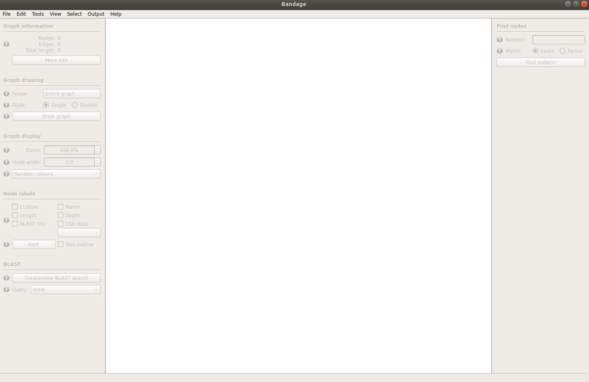
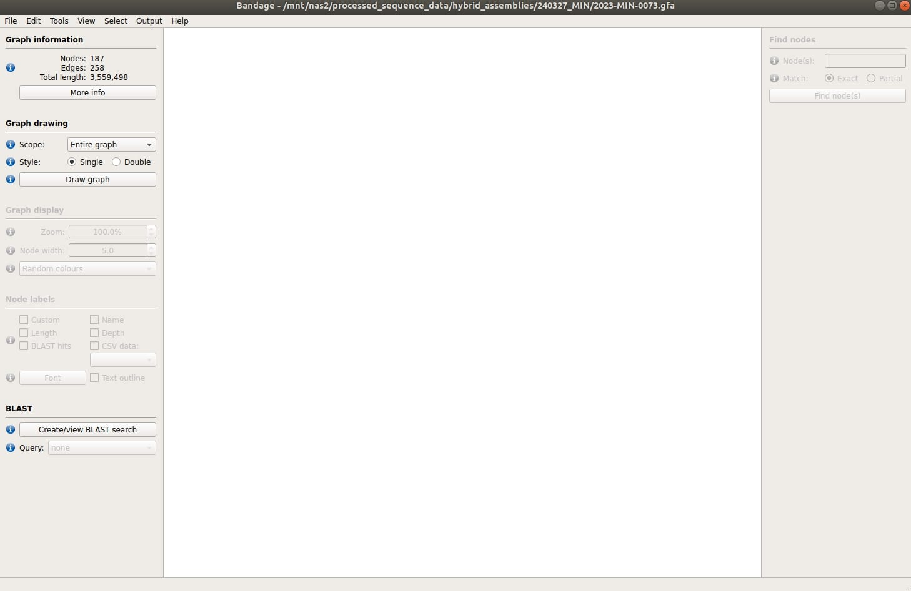
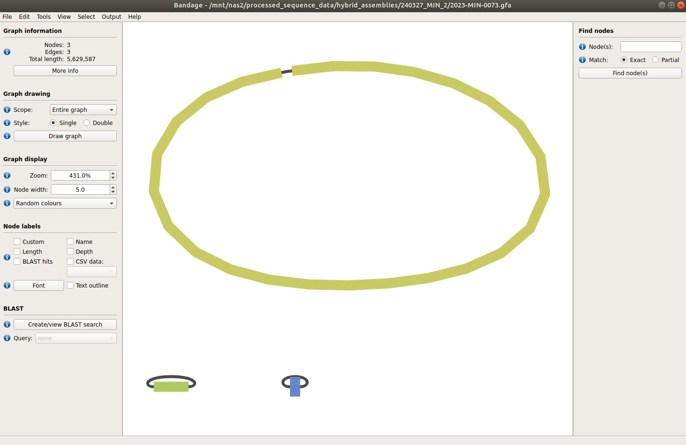
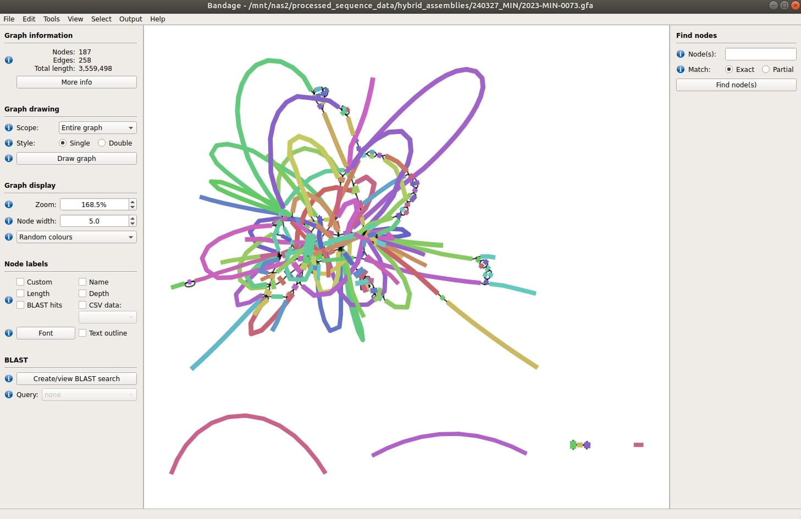

# GFA Retrieve and Bandage Diagram - Hybrid Assembly Viewer

### What does it do?

The GFA retrieve function will retrieve GFA files (.gfa - graph fragment assembly) that are created by the hybrid assembly pipeline. The program Bandage can be used to visualise these files. [Bandage](https://rrwick.github.io/Bandage/) displays connections which are not present in the contigs (assembly) file.

### How do I use the automator?

#### Subject

In the `Subject` field, put `gfaretrieve`.

#### Description

**Required Components**

All you need to put in the description is a list of SEQIDs you want to process, one per line.
  
**Currently, only the hybrid pipeline outputs .gfa files, so SEQIDs should be YYYY-MIN-NNNN**

#### Example

For an example gfa retrieve, see [issue 33691](https://redmine.biodiversity.agr.gc.ca/issues/33691).

### How do I download Bandage and view the assembly?

Bandage can (currently) be downloaded and used on windows corporate laptops. However, additional tools like BLAST are unfortunately not currently usable with the program on corporate Windows laptops/tablets (at the moment). To download, navigate to the [Bandage website](https://rrwick.github.io/Bandage/) and click "Download Windows". Extract the zip file to a location of your choosing. Within the unzipped folder, you will find a folder titled "Bandage", within this is "Bandage.exe". If you double-click "Bandage.exe" it should open the Bandage GUI for you:

- You can then open your .gfa files in the GUI, by clicking File > Load graph
    - this will open a window where you can search your computer for your .gfa file
    - once the gfa file is loaded, the GUI will look like this:

    - click "Draw graph" on the left panel, under the "Graph drawing" section, and it will draw a bandage diagram for you!

##### Bandage Graph Interpretation

**Good Hybrid Assembly**

- the below diagram is for 2024-MIN-0073, which is a *Klebsiella*. You can see that the hybrid assembly resulted in 3 separate contigs, likely one large contig for the chromosome and two smaller plasmids.

**Bad Hybrid Assembly**

- the below diagram is for a hybrid assembly in which incorrect Illumina reads were used. Illumina reads for an *Acinetobacter* isolate sequence were mapped to nanopore reads from a *Klebsiella* isolate sequence, which resulted in 93 contigs (instead of 3). You can see that the assembly is messy and very difficult to visualize/interpret. If your hybrid assembly looks like this, you should re-evaluate what sequences were used and/or speak with a bioinformatician.

### Bandage Tutorial

The [Bandage wiki](https://github.com/rrwick/Bandage/wiki/Getting-started) has a great tutorial of how to load data, as well as descriptions on how to visualize and manipulate data.

### How long does it take?

The time required for gfa file retrieval will depend on the number of SEQIDs in your request.

### What can go wrong?

1) Requested SEQIDs are not available. If we can't find some of the SEQIDs that you request, you will get a warning message informing you of it. This is likely to happen for older MIN sequences, where the pipeline did not create .gfa files.

