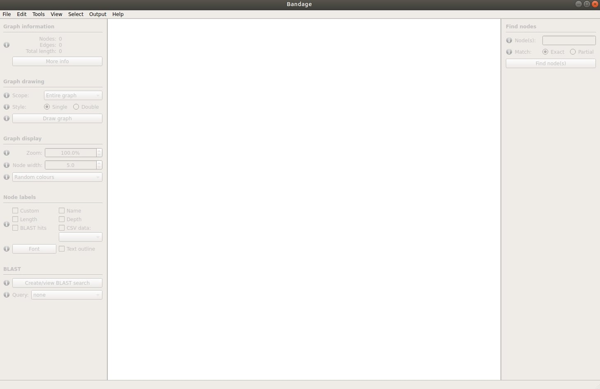
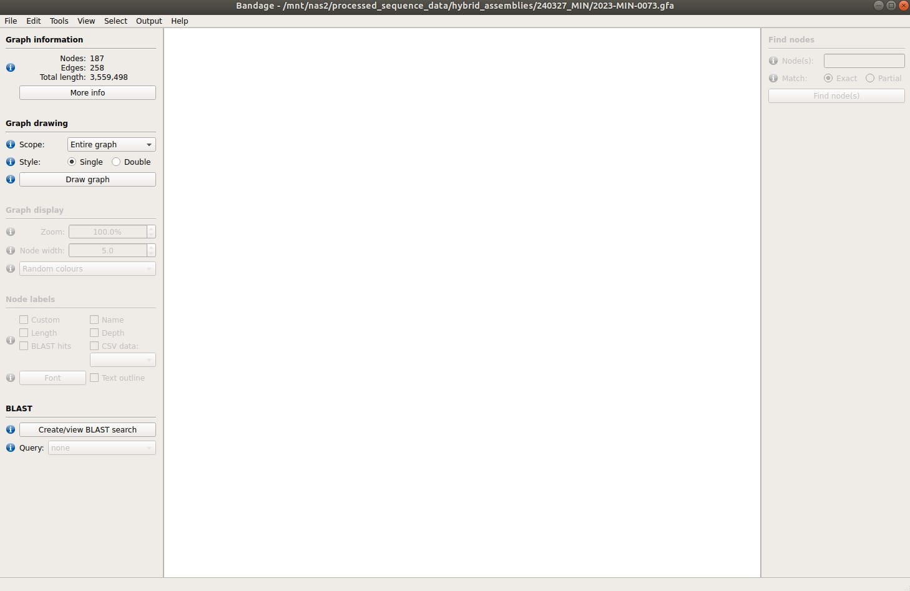
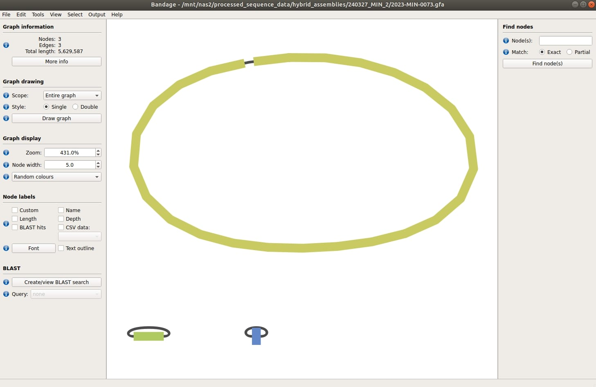
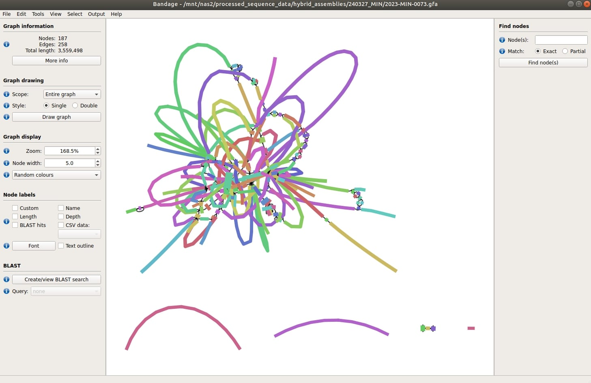

# GFA Retrieve and Bandage Diagram — Hybrid Assembly Viewer

## What does it do?

Use **GFA Retrieve** to obtain Graphical Fragment Assembly (`.gfa`) files produced by the hybrid assembly pipeline. A GFA file represents assembly-graph connections that are not visible in a standard contig FASTA file.

Use [Bandage](https://rrwick.github.io/Bandage/) to draw and inspect the graph. The graph can help identify simple, well-resolved assemblies and complex assemblies that may need further investigation.

Only the hybrid assembly pipeline currently produces GFA files, so requests should use MIN identifiers in the form `YYYY-MIN-NNNN`.

## How do I use it?

### Subject

In the **Subject** field, enter:

```text
gfaretrieve
```

### Description

In the **Description** field, enter one hybrid-assembly `SEQID` per line:

```text
2026-MIN-0001
2026-MIN-0002
```

Older MIN assemblies may not have a GFA file if they were created before the pipeline produced this output.

### Attachments

No attachment is required. GFA Retrieve locates the graph file associated with each requested hybrid assembly.

### Optional parameters

The supplied documentation does not identify optional parameters for GFA Retrieve.

### Example

```text
2026-MIN-0001
2026-MIN-0002
```

See [issue 33691](https://redmine-dev.cloud-nuage.inspection.gc.ca/issues/33691) for an example GFA Retrieve request.

## Interpreting results

Open each `.gfa` file in Bandage to visualize the assembly graph.

A simple graph with a small number of separate components can be consistent with a well-resolved hybrid assembly. For example, one large component may represent the chromosome and smaller components may represent plasmids. Graph structure alone is not definitive proof of chromosome or plasmid identity.

A tangled graph with many components or unresolved connections can indicate a complex or problematic assembly. Potential causes include incorrect read pairing, contamination, repeated regions, insufficient data, or combining Illumina and Nanopore reads from different isolates. Review the source data and consult a bioinformatician before drawing conclusions.

## Download and open Bandage

Bandage can currently be downloaded and used on corporate Windows laptops. Additional tools integrated with Bandage, such as BLAST, may not be available in that environment.

1. Go to the [Bandage website](https://rrwick.github.io/Bandage/).
2. Select **Download Windows**.
3. Extract the downloaded ZIP archive.
4. Open the extracted `Bandage` folder.
5. Double-click `Bandage.exe`.

The initial interface should resemble:



To load and draw a graph:

1. Select **File → Load graph**.
2. Choose the `.gfa` file.
3. After the file loads, select **Draw graph** in the **Graph drawing** panel.

A loaded graph should resemble:



### Example of a simple hybrid assembly graph

The following example is `2024-MIN-0073`, a *Klebsiella* hybrid assembly with three separate components. These may represent one chromosome and two plasmids.



### Example of a problematic hybrid assembly graph

The following example used Illumina reads from an *Acinetobacter* isolate with Nanopore reads from a *Klebsiella* isolate. The resulting graph contains 93 contigs and is difficult to interpret.



If a graph resembles this example, verify that the Illumina and Nanopore reads came from the same isolate and discuss the assembly with a bioinformatician.

For additional instructions, see the [Bandage getting-started tutorial](https://github.com/rrwick/Bandage/wiki/Getting-started).

## How long does it take?

GFA retrieval time depends on the number of requested `SEQID`s, file availability, and current service workload.

## What can go wrong?

### A requested `SEQID` is unavailable

**Symptom:** The Redmine issue receives a warning identifying unavailable sequences or graph files.

**Likely cause:** The `SEQID` is incorrect, the hybrid assembly is unavailable, or the assembly has no GFA output.

**What to do:** Verify the `SEQID` and confirm that it is a hybrid `YYYY-MIN-NNNN` assembly.

### An older MIN assembly has no GFA file

**Symptom:** The assembly exists, but GFA Retrieve cannot return a graph file.

**Likely cause:** The assembly was generated before the hybrid pipeline produced GFA files.

**What to do:** Consult a bioinformatician to determine whether the graph can be regenerated.

### Bandage cannot use an integrated BLAST function

**Symptom:** Bandage opens and draws a graph, but an additional BLAST-dependent feature does not work on the corporate Windows device.

**Likely cause:** The supporting BLAST programs are not available in the corporate Windows environment.

**What to do:** Use Bandage for graph visualization and consult a bioinformatician if BLAST-assisted graph analysis is required.

### The graph is highly fragmented or tangled

**Symptom:** Bandage shows many components or complex unresolved connections.

**Likely cause:** The assembly may contain mismatched reads, contamination, repeated regions, insufficient data, or another assembly-quality issue.

**What to do:** Verify that the Illumina and Nanopore reads belong to the same isolate, review sequence quality, and consult a bioinformatician.

## Related automators

- [SequenceExtractor](sequence_extractor.md) — extracts a nucleotide interval or complete contig from an assembly.
- [MobSuite](mobsuite.md) — predicts plasmid-derived contigs and performs plasmid typing in draft genome assemblies.
