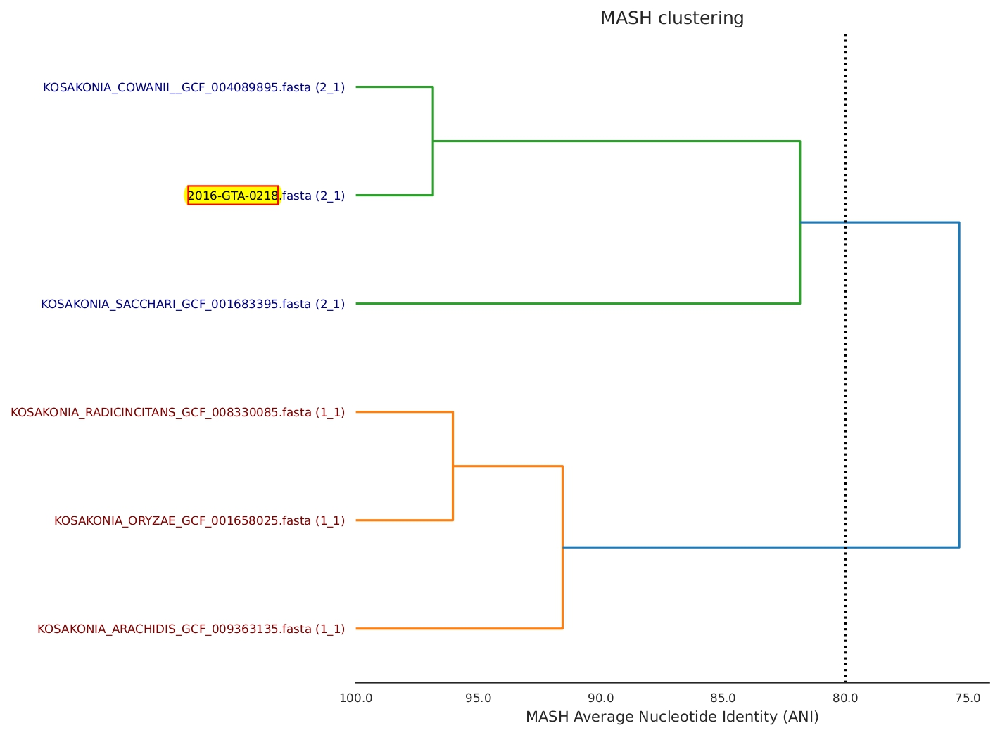

# Unknownisolate - Genus/species determination

### What does it do?

The Unknownisolate tool was developed at OLC to output information for species identification of a query sequence. It is ideally used where the MASH and 16S outputs from the COWBAT pipeline don't agree or have a low number of hits (e.g. less than 500/1000 for MASH), or if you are uncertain of the species. The pipeline will first analyse the query sequence assembly using pubMLST and output the closest pubMLST match and support (%), then compare your query to a number of ATCC and RefSeq reference sequences to determine the Average Nucleotide Identity (ANI). The final output will be a Genomic Record of Bacterial Identification (GROBI) pdf report, which will include the pubMLST, ANIb, and ANIm closest match results.

### How do I use it?

#### Subject

In the `Subject` field, put `unknownisolate`. Spelling counts, but case sensitivity doesn't.

#### Description

**Required Components**

The first line of the description should be the analysis you would like to run (e.g. `analysis=enterobacterales`). This will depend on what you believe your sequence to be closely related to, if you have an evidence.

- The following options are currently supported:
    - `bacillus` - to compare to genus <i>Bacillus</i>
    - `custom` - to compare to a custom list of SeqIDs - **only recommended if you would like to compare specific sequences... will only include the SeqIDs listed by user, and by excluding reference sequences you are likely to miss something that may be closely related**
    - `enterobacter` - to compare to genus <i>Enterobacter</i>
    - `enterobacterales` - to compare to order Enterobacterales
    - `genus` - to compare to a specific genus  
       The user must also include the line:
        - `genus=QUERY` where QUERY is the genus (e.g. `genus=Acinetobacter`)
    - `listeriaceae` - to compare to family Listeriaceae
    - `mycobacterium` - to compare to genus <i>Mycobacterium</i>
    - `unknown` - to compare to all reference sequences. **Will take a long time to run**

You must also include a query SeqID:

   - `query=SEQID`

 
**Optional Components**

There are currently no user-options. By default, unknownisolate will run the analysis for query assembly first using pubMLST, then by calculating MASH distances and to filter for the most closely related organisms, and calculate ANI for the query and closely related sequences. If you would like customizable options, please contact a bioinformatician.

#### Example

For an example unknown isolate analysis, see [issue 33337](https://redmine.biodiversity.agr.gc.ca/issues/33337).

#### Pipeline Description

As mentioned above, unknownisolate will run the analysis for query assembly first using pubMLST, then by calculating MASH distances. The MASH distances are used to sort and filter for the most closely related sequences using the [NearTree](neartree.md) automator. For most options, the top 40 related sequences (up to 40, as determined by MASH distance) will be included in subsequent steps; for <i>Mycobacterium</i> only the top 15 closest sequences will be included (this is for computational and time purposes, <i>Mycobacterium</i> takes longer...).
The top related sequences and the query are then compared using [dRep compare](https://drep.readthedocs.io/en/latest/overview.html#genome-comparison) to produce a MASHtree output.
The final step is to determine the ANIb and ANIm of the query sequences and close matches, then output the GROBI report as a pdf file.

#### Interpreting GROBI Report
- Output table:
    - The output table on the first page of the GROBI report will include the Matching reference (i.e. Genus and species) for the top hits from rMLST, ANIb, ANIm, and MASH. Example:

    | Analysis | Matching Reference |  Support  |
    |:----------:|:-----------------:|:-----------:|
    | rMLST | Kosakonia cowanii |  96%  |
    | ANIb | KOSAKONIA_COWANII_GCF_004089895 | 0.96877696 |
    | ANIm | KOSAKONIA_COWANII_GCF_004089895 | 0.96940371 |
    | MASH | KOSAKONIA_COWANII_GCF_004089895 | 356/1000 |

    - If species for all analysis types (rMLST, ANIb, ANIm, MASH) are the same, you can likely assume that the species is determined/correct (e.g. above species would be <i>Kosakonia cowanii</i>)
 
 
    - **If the species disagree** - Example:

    | Analysis | Matching Reference |  Support  |
    |:----------:|:-----------------:|:-----------:|
    | rMLST | Enterobacter sichuanensis |  13%  |
    | ANIb | ENTEROBACTER_ASBURIAE_GCF_001521715 | 0.86544877 |
    | ANIm | ENTEROBACTER_ASBURIAE_GCF_001521715 | 0.87473895 |
    | MASH | ENTEROBACTER_BUGANDENSIS_GCF_015137655 | 41/1000 |

    - The table above shows a case where the rMLST, ANIb, ANIm, and MASH results disagree. There is a possibility the sequence is from a novel species, but other precautions should be taken before coming to this conclusion:
        - What analysis was selected? If it was custom or genus specific, you may want to select a broader analysis type.
        - Check that close/probable species are included in our reference files. In the example above, ANIb is still above 80%, so we can be fairly confident this sequence may be an <i>Enterobacter</i> species. You may need to request the current list of reference sequences from ashley.cooper@inspection.gc.ca. Sometimes, especially with Enterobacteriaceae and newly re-classified genera, there are not reference ATCC sequences available. In these cases we have downloaded reference sequences for species not found (e.g. Tatumella and Enterobacter species). The [Microbial Genome Browser](https://www.ncbi.nlm.nih.gov/datasets/genome/?taxon=1386) is an excellent resource to look at available genera/species. If you find all possible species that you believe are related are also represented in our database, your sequence 'may' be a novel species.
        - Contact adam.koziol@inspection.gc.ca and catherine.carrillo@inspection.gc.ca to discuss next steps.

- rMLST (ribosomal Multilocus Sequence Typing):
    - the rMLST support is determined by [pubMLST](https://pubmlst.org/). It is determined using the 53 genes encoding the bacterial ribosome protein subunits (<i>rps</i> genes).

- dRep compare primary clustering dendrogram (tree):

    - The dendrogram/tree is produced by the dRep compare bioinformatic program. This output is then taken and the query sequence is highlighted for the GROBI report. The query SeqID will cluster with closely related sequences (as determined by dRep using MASH).
    - The primary clustering dendrogram output by dRep compare summarizes the pair-wise MASH distance between all genomes in the genome list. The dotted line provides a visualization of the primary ANI threshold (set to 80% for the unknownisolate automator). This tree is not created from genome alignments. This tree is created from the MASH-distances (distances between isolates calculated by MASH). If you would like a phylogenetic tree, please run an automator for tree-building (e.g. bcgtree).

- ANIb:
    - ANI (average nucleotide identity) is a pairwisemeasure of overall similarity between two genome sequences. ANIb analysis is considered the standard method in prokaryotic taxonomy. It uses BLASTN+ for average nucleotide identity calculations. The ANIb method aligns 1020nt fragments of the input sequences. More information regarding ANI calculations can be found at [Whole-Genome Analyses: ANI](https://www.sciencedirect.com/science/article/pii/S0580951714000087)

- ANIm:
    - ANIm analysis uses MUMmer for average nucleotide identity calculations. The MUMmer program performs ultrafast alignment of two genomes. More information regarding ANI calculations can be found at [Whole-Genome Analyses: ANI](https://www.sciencedirect.com/science/article/pii/S0580951714000087)

#### Databases Used by the Automator

For a list of ATCC and RefSeq assemblies currently available/used by the automator, please contact ashley.cooper@inspection.gc.ca or adam.koziol@inspection.gc.ca

### How long does it take?

The time required for analysis will depend on the analysis type. The unknown analysis will take hours. The <i>Mycobacterium</i> analysis may also take a while.

### What can go wrong?

1) Requested SEQIDs are not available. If we can't find some of the SEQIDs that you request, you will get a warning message informing you of it.

2) A genus analysis was requested but genus was not specified. You will get a warning message informing you of it. You must also add the flag `genus=GENUS` for the automator to recognize and select the specific genus' files from the ATCC and RefSeq folders.

