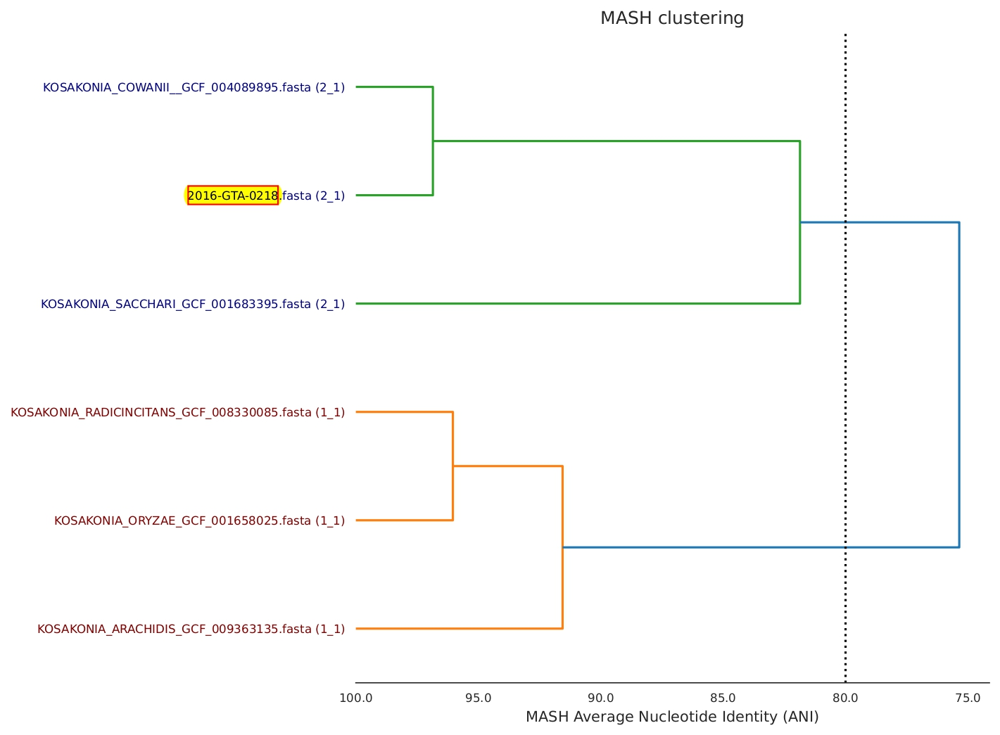

# Unknown Isolate — Genus and Species Determination

## What does it do?

Use **Unknown Isolate** when the genus or species of a draft genome assembly is uncertain, especially when COWBAT MASH and 16S results disagree or have weak support.

The workflow combines several lines of evidence:

1. rMLST analysis through pubMLST;
2. MASH-distance comparison with selected ATCC and RefSeq references;
3. ANIb calculation using BLAST-based average nucleotide identity;
4. ANIm calculation using MUMmer-based average nucleotide identity;
5. a Genomic Record of Bacterial Identification (GROBI) PDF report summarizing the closest matches.

Unknown Isolate is designed for an assembled isolate genome. It is not intended to identify organisms directly from mixed raw reads.

## How do I use it?

### Subject

In the **Subject** field, enter:

```text
unknownisolate
```

Spelling matters, but matching is not case-sensitive.

### Description

The Description must contain:

1. an analysis declaration; and
2. one query assembly in the form `query=SEQID`.

General form:

```text
analysis=ANALYSIS_NAME
query=2026-SEQ-0001
```

### Supported analyses

#### `bacillus`

Compares the query with references from genus *Bacillus*.

```text
analysis=bacillus
query=2026-SEQ-0001
```

#### `enterobacter`

Compares the query with references from genus *Enterobacter*.

#### `enterobacterales`

Compares the query with references from order Enterobacterales.

#### `genus`

Compares the query with a specified genus. Also include `genus=QUERY`, where `QUERY` is the genus name.

```text
analysis=genus
genus=Acinetobacter
query=2026-SEQ-0001
```

#### `listeriaceae`

Compares the query with references from family Listeriaceae.

#### `mycobacterium`

Compares the query with references from genus *Mycobacterium*. This analysis can take longer than many of the other targeted analyses.

#### `unknown`

Compares the query with all available reference sequences.

```text
analysis=unknown
query=2026-SEQ-0001
```

This is the broadest and slowest option and can take several hours.

#### `custom`

Compares the query only with a user-supplied list of `SEQID`s. Use this mode only when specific comparisons are required. Excluding standard references can omit a more closely related organism.

The supplied documentation does not show the exact syntax used to provide the custom comparison list. Verify a working request or the implementation before publishing a custom example.

### Attachments

The supplied documentation does not identify a required attachment for the standard analysis modes. The query is identified with `query=SEQID`.

### Optional parameters

The supplied documentation does not identify user-configurable parameters beyond the required `analysis`, `query`, and analysis-specific `genus` fields. Contact a bioinformatician if a different comparison strategy is required.

### Example

See [issue 33337](https://redmine-dev.cloud-nuage.inspection.gc.ca/issues/33337) for an example Unknown Isolate request.

## How the workflow selects comparisons

Unknown Isolate first runs rMLST through pubMLST and calculates MASH distances between the query and candidate references.

MASH distance is used to rank and filter related genomes through the [NearTree](neartree.md) workflow:

- most analysis modes retain up to the 40 closest sequences;
- the *Mycobacterium* mode retains up to the 15 closest sequences to limit computational time.

The query and selected related genomes are then compared with [dRep compare](https://drep.readthedocs.io/en/latest/overview.html#genome-comparison) to create a MASH-based primary clustering dendrogram. The workflow calculates ANIb and ANIm between the query and close matches and incorporates the results into the GROBI report.

## Interpreting the GROBI report

The first page contains a table summarizing the closest matches from rMLST, ANIb, ANIm, and MASH.

Example of concordant evidence:

| Analysis | Matching reference | Support |
|---|---|---:|
| rMLST | *Kosakonia cowanii* | 96% |
| ANIb | `KOSAKONIA_COWANII_GCF_004089895` | 0.96877696 |
| ANIm | `KOSAKONIA_COWANII_GCF_004089895` | 0.96940371 |
| MASH | `KOSAKONIA_COWANII_GCF_004089895` | 356/1000 |

When all methods identify the same species, the combined evidence supports that identification more strongly than any single method alone.

### When the methods disagree

Example of discordant evidence:

| Analysis | Matching reference | Support |
|---|---|---:|
| rMLST | *Enterobacter sichuanensis* | 13% |
| ANIb | `ENTEROBACTER_ASBURIAE_GCF_001521715` | 0.86544877 |
| ANIm | `ENTEROBACTER_ASBURIAE_GCF_001521715` | 0.87473895 |
| MASH | `ENTEROBACTER_BUGANDENSIS_GCF_015137655` | 41/1000 |

Disagreement does not by itself prove that the query represents a novel species. Before drawing that conclusion:

1. Check whether the selected analysis scope was too narrow. Repeat with a broader mode if appropriate.
2. Confirm that plausible related species are represented in the reference collection.
3. Review evidence for contamination, assembly quality, and mixed data.
4. Compare current public reference genomes using the [NCBI Microbial Genome Browser](https://www.ncbi.nlm.nih.gov/datasets/genome/?taxon=1386).
5. Consult the bioinformatics team about additional references or follow-up analysis.

An ANIb value above 80% can support placement within a broad related group, but should not be treated as a universal species-level identification threshold.

### rMLST

rMLST support is determined through [pubMLST](https://pubmlst.org/) using 53 genes encoding bacterial ribosomal protein subunits. Low support weakens the confidence of the rMLST assignment.

### Primary clustering dendrogram



The dRep primary clustering dendrogram summarizes pairwise MASH distances among the query and selected genomes. The query is highlighted in the GROBI report.

The dotted line visualizes the primary ANI threshold configured at 80% for this workflow. The dendrogram is based on MASH distances, not a whole-genome alignment, and is not a phylogenetic tree. Use a dedicated tree-building automator such as [bcgTree](bcgtree.md) when a phylogeny is required.

### ANIb

Average nucleotide identity by BLAST uses BLASTN+ to compare 1,020-nucleotide fragments between genomes. ANIb is commonly used in prokaryotic taxonomy.

### ANIm

Average nucleotide identity by MUMmer uses MUMmer for rapid whole-genome comparison.

For background on ANI methods, see [Whole-Genome Analyses: ANI](https://www.sciencedirect.com/science/article/pii/S0580951714000087).

## Reference databases

The automator uses selected ATCC and RefSeq assemblies. The collection can include additional references for organisms that are absent or underrepresented in the standard sets.

Because reference collections change, request the current reference list from the bioinformatics team when interpretation depends on whether a particular genus or species is represented.

## How long does it take?

Runtime depends strongly on analysis scope and organism. Targeted analyses are faster than the broad `unknown` mode. The `unknown` mode can take several hours, and the *Mycobacterium* mode can also take a long time.

## What can go wrong?

### The query `SEQID` is unavailable

**Symptom:** The Redmine issue receives a warning that the query sequence cannot be found.

**Likely cause:** The `SEQID` is incorrect or its draft assembly is unavailable.

**What to do:** Verify `query=SEQID` and confirm that the assembly exists.

### A genus analysis does not specify a genus

**Symptom:** The Redmine issue reports that the requested genus cannot be selected.

**Likely cause:** `analysis=genus` was supplied without `genus=GENUS`.

**What to do:** Add the required genus line, for example `genus=Acinetobacter`.

### The selected comparison set is too narrow

**Symptom:** rMLST, ANI, and MASH results disagree or no plausible species is represented among the closest references.

**Likely cause:** A genus-specific or custom analysis excluded relevant reference genomes.

**What to do:** Repeat the analysis with a broader supported mode and verify reference coverage.

### The evidence is weak or conflicting

**Symptom:** Methods identify different species, rMLST support is low, or MASH reports few matching hashes.

**Likely cause:** The query may be divergent, poorly assembled, contaminated, mixed, or absent from the available reference collection.

**What to do:** Review assembly and contamination quality, inspect all evidence together, verify reference coverage, and consult a bioinformatician before suggesting a novel species.

## Related automators

- [AutoCLARK](autoclark.md) — identifies species represented in raw reads or assemblies but does not produce the Unknown Isolate GROBI comparison workflow.
- [ConFindr](confindr.md) — tests raw reads for intra-species and inter-species contamination.
- [NearTree](neartree.md) — finds closely related sequences using MASH distance.
- [bcgTree](bcgtree.md) — creates a gene-based phylogeny when an actual phylogenetic tree is required.
