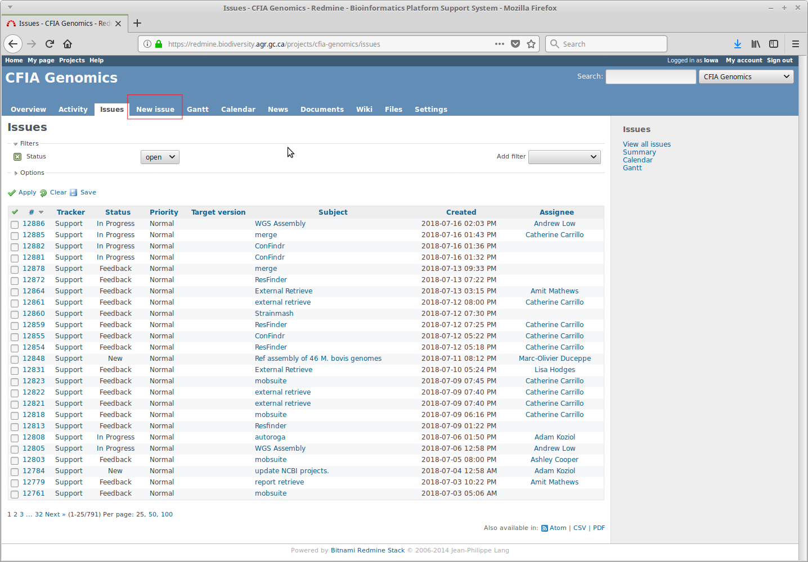
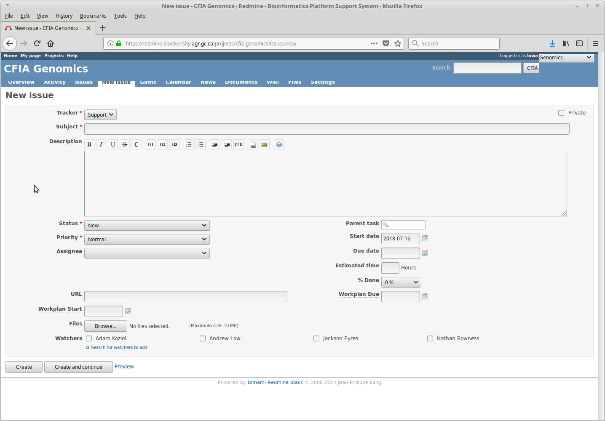

# Getting Started with the OLC Redmine Automator

## What is Redmine, and what can I use it for?

Redmine is an issue-tracking system configured by OLC to submit bioinformatics and data-management requests to automated workflows.

You can use it to:

- [retrieve raw reads or assemblies](data/external_retrieve.md);
- [retrieve assembly reports](data/report_retrieve.md);
- [detect acquired antimicrobial-resistance genes](analysis/resfinder.md);
- [identify and type predicted plasmids](analysis/mobsuite.md);
- [build or inspect phylogenetic trees](analysis/mashtree.md);
- [compare an assembly with RefSeq type strains](analysis/strainmash.md);
- run many other analyses described on the [documentation home page](index.md).

Each request is a Redmine issue. The issue Subject selects the automator, while the Description and attachments provide its inputs and options.

## Accessing Redmine

Open the CFIA Redmine service at:

[https://redmine-dev.cloud-nuage.inspection.gc.ca/](https://redmine-dev.cloud-nuage.inspection.gc.ca/)

Access requires the appropriate organizational network and project permissions. Sign in with your corporate credentials.

If you cannot see the CFIA Genomics project or cannot create an issue, contact the bioinformatics team and request project access. Include your corporate username and the project you need; do not send your password.

After access is granted, open the CFIA Genomics project and create requests from its issue page.

## Adjusting email notifications

Redmine notification defaults can generate more email than needed.

1. Select **My account** in the upper-right corner.
2. Find the email-notification setting.
3. Choose a level appropriate for your work, such as notifications only for issues you watch or are involved in.
4. Select **Save**.

The exact labels can vary by Redmine version.

## Creating a request

1. Open the CFIA Genomics project.
2. Select **New issue**.
3. Enter the exact automator keyword in **Subject**.
4. Enter the required `SEQID`s, parameters, and structure in **Description**.
5. Add any required attachment.
6. Review the request against the automator's documentation.
7. Select **Create**.





## Subject, Description, and attachments

### Subject

The Subject routes the issue to an automator. Spelling matters. Most automators match without case sensitivity, but use the documented capitalization and punctuation to avoid errors.

Examples:

```text
fastqc
ResFinder
External Retrieve
```

### Description

The Description supplies parameters and identifiers. Many simple requests contain one `SEQID` per line:

```text
2026-SEQ-0001
2026-SEQ-0002
```

Other automators require structured lines such as:

```text
analysis=custom
reference=2026-SEQ-0001
```

Copy parameter names exactly from the relevant page. Put parameters before the `SEQID` list unless that page specifies another order.

### Attachments

Some automators require an attachment, such as a custom target FASTA, traits table, reference genome, or Excel workbook. Check:

- required filename;
- required extension;
- field or header structure;
- file-size limit;
- whether Description entries are ignored when an attachment is present.

Do not attach passwords or sensitive information unless the documented workflow explicitly requires temporary credentials and the issue has appropriate access controls.

## Choosing the correct input type

Before submitting, determine whether the automator uses:

- raw paired-end FASTQ reads;
- Nanopore or other single-end reads;
- a draft genome assembly in FASTA format;
- an attached custom reference or target file;
- a report or previously generated Redmine result.

A valid `SEQID` is not enough if the required data type is unavailable. For example, an assembly-based tool cannot run when only raw reads exist.

## Monitoring a request

After creating an issue, Redmine records status updates and automator comments. Depending on the workflow, the issue may report:

- validation warnings;
- unavailable `SEQID`s;
- queue or processing status;
- tool and database versions;
- result attachments;
- Dropbox or other download links;
- completion or error details.

Requests may begin within minutes, but completion ranges from seconds to hours depending on the workflow, dataset size, queue, and available compute resources.

Download time-limited results promptly and retain the Redmine issue number with your analysis records.

## Interpreting an issue outcome

A closed issue can represent either successful completion or a completed failure-handling path. Read the final comments and verify that expected result files are present.

Before using results:

1. confirm that every expected sample was processed;
2. review warnings for missing or divergent inputs;
3. record the tool and database versions when available;
4. inspect quality and coverage metrics;
5. follow the automator page's interpretation guidance;
6. avoid treating computational predictions as experimentally confirmed findings.

## If something goes wrong

Start with the [Troubleshooting guide](troubleshooting.md) and the **What can go wrong?** section on the automator page.

When asking for assistance, provide:

- the Redmine issue number;
- the automator Subject;
- the relevant error message;
- the approximate submission time;
- the expected versus observed result.

Do not send passwords or other reusable credentials by email or in a new public issue.
