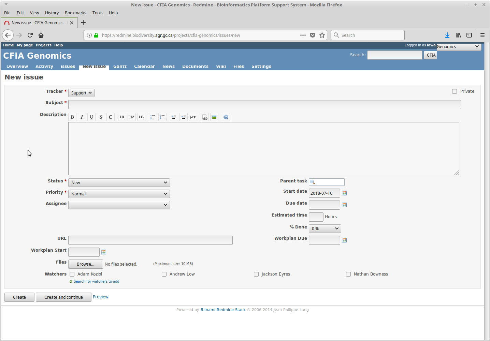

# What is Redmine, and what can I use it for?

Redmine is a system for project management and issue tracking that OLC has configured to automate a number of
bioinformatics tasks. With Redmine, you can [retrieve genomic data](data/external_retrieve.md)
(either raw reads or draft assemblies) that is stored at OLC to perform your own analysis locally, [look for
antibiotic resistance genes](analysis/resfinder.md) or [find plasmids](analysis/mobsuite.md) in assemblies,
[create phylogenetic trees](analysis/diversitree.md), compare [strains against RefSeq](analysis/strainmash.md), and more.

If a tool you need is not currently available, we are generally able to add tools on request.

### Accessing Redmine

To access Redmine, go to [https://redmine.biodiversity.agr.gc.ca](https://redmine.biodiversity.agr.gc.ca) (note that you
must be on the CFIA/Agriculture Canada network). Once there, login with your corporate username and password. If this is
your first time using Redmine, you will need to be added to the CFIA Genomics project. To get access, send an email
to `ashley.cooper@inspection.gc.ca`, with `adam.koziol@inspection.gc.ca` CC'd and say you need access to the OLC Genomics project. Once you have been added to the project,
head to [the project page](https://redmine.biodiversity.agr.gc.ca/projects/cfia/issues). This is where you will
be able to create requests.

#### Changing Email Settings

By default, Redmine likes to send you emails about literally every issue that anybody reports, which can lead to
receiving far more emails than anybody has ever wanted to receive. To change this, click on the `My Account` button (found
in the top right corner when logged in to Redmine) and change the dropdown for email notifications from `For any event
on all my projects` to something else - I recommend `Only for things I watch or I'm involved in`. Once that's done, hit
the `Save` button on the bottom left of the screen to make sure Redmine remembers your email preferences.

### Creating Issues

Everything in Redmine is done by creating `Issues` - these are requests for an analysis to be done.

To create a new issue, click on the `New Issue` button, as shown in the below screenshot.

`Click to see screenshot`

The page for new issues can be seen in the next screenshot. To have your analyses done, specific keywords are put in the
`Subject` header, with any necessary details put in the `Description` section. Details on what exactly needs to be put
into each section are under the `Data` and `Analysis` tabs for specific tools. Once an issue has been filled out, click
on the `Create` button. Once that's done you can sit back and relax - you'll receive emails when your request has been
submitted to our compute cluster (which should happen within a minute or two from the time you submitted your issue),
and another once your job has completed (which, depending on the request, can be anywhere from a few minutes to a few
hours).

`Click to see screenshot`

 
&nbsp;
## Possible Analyses
###I want to:

  
<b>Download sequence data, or share sequence data with a collaborator</b>
  
  To retrieve a zip file of your sequence data (which can also be shared with external collaborators) use automators:  

   * **External retrieve** - exports a list of sequences in a zipped file

 

  
<b>Detect gene(s) in my sequences</b>
  
  Automators that allow you to screen sequence(s) for gene targets:  

   * **GeneSeekr** - assemblies only  
   * **KMA** - allows you to screen raw reads and assemblies

 

  
<b>Determine the genus/species of a whole genome sequence assembly</b>
  
  If you are unsure of the genus/species of your isolate, you can use the automator:  

   * **Unknownisolate** - compares WGS assembly to ATCC and RefSeq genomes, and determines rMLST type

 

  
<b>Determine taxonomy in metagenomes</b>
  
  If you want to detect the different organisms in your metagenomic sequence, you can use the automators:  

   * **Metaphlan** - more specific than Kraken2, but less sensitive
   * **Kraken2/Bracken** - more sensitive than metaphlan, but likely to give false positives to closely related genera/species. Bracken is more accurate than Kraken2.

 

  
<b>Find SNPs in my sequences</b>
  
  To detect single nucleotide polymorphisms (SNPs) in your sequences, you can use the automators:  

   * **SNVPhyl** - 
   * **Snippy** - 

 

  
<b>Annotate my sequence assemblies</b>
  
  To annotate your sequence assemblies, you can use the automators:  

   * **Prokka** - 
   * **Bakta** - 

 

  
<b>Create a phylogeny</b>
  
  You can use the automators:  

   * **MASHtree** - 
   * **bcgtree** - 
   * **iqtree** - 

 

  
<b>Run a genome wide association study (GWAS)</b>
  
  You can use the automators:  

   * **Roary/Scoary** - 
   * **Pyseer** - 

 

