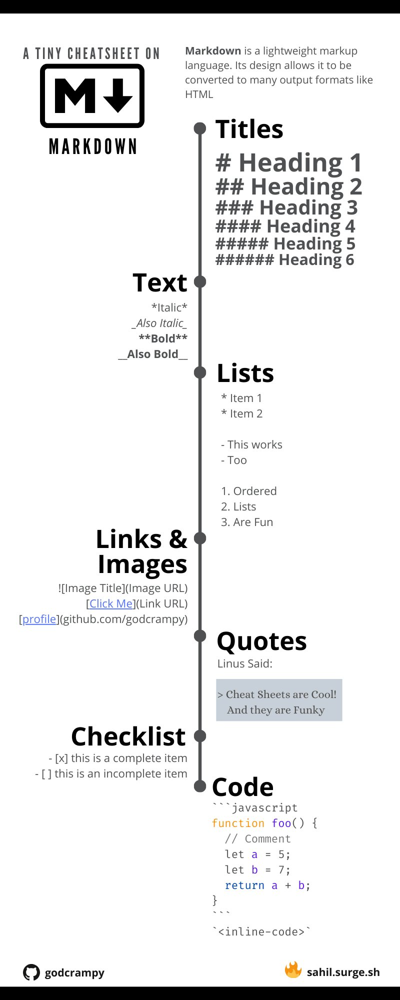

## Edit pages

This is the way I edit pages. Feel free to use any method with which you are comfortable

- Get the mkdocs preview started `mkdocs serve`

- Navigate to the served pages in your browser e.g. `http://127.0.0.1:8000/redmine-docs/` 

- Ensure that the page you are going to edit is present in the Nav bar e.g. 'Analysis' -> 'SISTR'  
 
- In your files, find the markdown (.md) file associated with the page you want to edit within the redmine-docs folder under 'docs' (nas2/redmine/redmine-docs/docs)
	- Right-click the file to open the markdown file with your favourite editor (R, Text Editor, etc.)

- Update the documentation using markdown language
	- Use one of the other files in the folder as a template to ensure that you follow the same basic format each time
	- Note that markdown supports HTML so you can integrate HTML tags to further customize your page

- Save your text document in order to refresh your served page and view your changes

- Note that your changes are not actually published on the website until you push them on Github (see [Publish Changes](../tutorials/publish_changes.md) tutorial)
	
Basic markdown cheatsheet:

